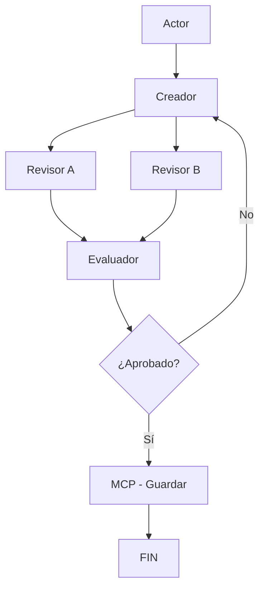

# Sistema de Creación de Monólogos con LangGraph y Google Gemini

Sistema automatizado para crear monólogos teatrales usando LangGraph y Google Gemini con un flujo de revisión y mejora iterativa.

## Estructura del Proyecto

```
📁 AgNNTic/
├── 📄 agent.py          # Archivo principal de ejecución
├── 📄 state.py          # Definiciones de estado del grafo
├── 📄 config.py         # Configuración del modelo Gemini
├── 📄 nodes.py          # Nodos del grafo LangGraph
├── 📄 flow.py           # Definición del flujo del grafo
├── 📄 tools.py          # Herramientas y utilidades
└── 📄 README.md         # Este archivo
```

## Descripción de Archivos

### `state.py`

- Define la clase `MonologoState` con todos los campos del estado del grafo
- Incluye documentación de tipos y descripciones de cada campo

### `config.py`

- Configura el modelo Google Gemini
- Maneja la API key desde variables de entorno
- Proporciona función `get_model()` para acceder al modelo

### `nodes.py`

- Contiene todos los nodos del grafo:
  - `nodo_actor`: Maneja inputs iniciales
  - `nodo_creador`: Genera el monólogo
  - `nodo_revisor_a`: Revisa estructura y narrativa
  - `nodo_revisor_b`: Revisa lenguaje y conexión emocional
  - `nodo_evaluador`: Decide si continuar o finalizar
  - `nodo_mcp`: Guarda el monólogo final

### `tools.py`

- Funciones utilitarias:
  - `guardar_monologo()`: Guarda archivos
  - `decidir_siguiente_paso()`: Lógica de decisión del flujo

### `flow.py`

- Define la estructura del grafo LangGraph
- Función `crear_grafo_monologo()`: Construye el grafo
- Función `ejecutar_sistema_monologo()`: Ejecuta el flujo completo

### `agent.py`

- Archivo principal simplificado
- Función `main()` con ejemplo de uso
- Punto de entrada del sistema

## Flujo del Sistema



## Uso

1. **Ejecutar el sistema completo**:

   ```bash
   python agent.py
   ```

2. **Usar como módulo**:

   ```python
   from flow import ejecutar_sistema_monologo

   inputs = {
       "tema": "Tu tema aquí",
       "tono": "Tu tono deseado",
       "duracion": "2-3 minutos",
       "audiencia": "Tu audiencia objetivo"
   }

   resultado = ejecutar_sistema_monologo(inputs, max_iteraciones=3)
   ```

## Configuración

Configura tu API key de Google Gemini:

```bash
export GEMINI_API_KEY="tu_api_key_aqui"
```

## Dependencias

- `langgraph`
- `google-generativeai`
- `typing` (incluido en Python estándar)

## Características

- ✅ **Modular**: Código separado por responsabilidades
- ✅ **Documentado**: Docstrings en todas las funciones
- ✅ **Reutilizable**: Componentes independientes
- ✅ **Escalable**: Fácil agregar nuevos nodos o modificar el flujo
- ✅ **Mantenible**: Estructura clara y organizada
